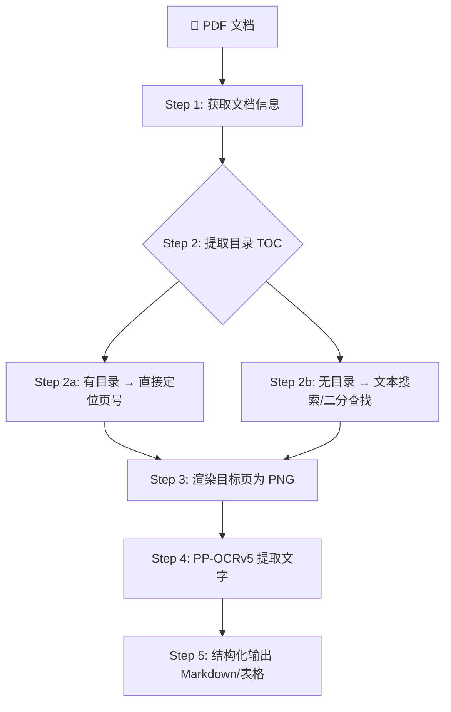

# Extract Section from Document

从超长 PDF 文档（如年报、招股书、研报）中精确提取指定章节内容，无需 OCR 全部页面。

## 工作流程



## Step 1 — 获取文档信息

先用 `pdf-tool info` 了解文档结构：

```bash
pdf-tool info <pdf_path>
```

输出包含：页数、元数据、作者、创建工具等。

## Step 2 — 从目录定位章节页码

### 方法 A：有书签目录（首选）

Python 提取 PDF 书签（TOC）：

```python
import fitz
doc = fitz.open(pdf_path)
toc = doc.get_toc()  # [(level, title, page), ...]
for item in toc:
    print(f"L{item[0]} | p{item[2]} | {item[1]}")
doc.close()
```

在 TOC 中搜索关键词，找到目标章节的起始页码。

### 方法 B：无书签目录（降级方案）

如果 PDF 没有标准书签，先提取少量文字样本初步定位。

### 方法 C：复杂文档（如扫描件）

先 OCR 目录页（通常前几页）定位章节位置。

## Step 3 — 渲染 PDF 页面为 PNG

使用 PyMuPDF（fitz）将目标页转为高清 PNG：

```python
import fitz
doc = fitz.open(pdf_path)
page = doc[page_number]  # 0-indexed
pix = page.get_pixmap(dpi=200)
pix.save("output_page.png")
doc.close()
```

- **dpi=200** 适合一般文档
- **dpi=300** 适合小字体/密集表格
- 如果章节跨多页，批量渲染

## Step 4 — PP-OCRv5 提取文字

使用 `pp-ocrv5` 源的 `ocr` 工具对 PNG 进行文字提取：

```markdown
mcp__pp-ocrv5__ocr({
  input_data: "/path/to/page.png",
  output_mode: "simple"
})
```

- **output_mode: "simple"** 输出纯文本，适合提取后再整理
- **output_mode: "detailed"** 输出含坐标的 JSON，适合精确布局分析
- 多页逐页 OCR，每次处理一页

## Step 5 — 结构化输出

根据内容类型选择合适的展示格式：

| 内容类型 | 推荐格式 | 说明 |
|:---|:---|:---|
| 财务报表 | `datatable` 或 `spreadsheet` | 可排序、筛选 |
| 文字段落 | Markdown | 纯文本阅读 |
| HTML 邮件 | `html-preview` | 富文本渲染 |
| 源代码 | Code block | 语法高亮 |
| 对比数据 | `image-preview`（多页 tab） | 前后对照 |

## 注意事项

1. **章节可能跨多页** — 先看 TOC 中下一节的起始页，确定范围
2. **表格数据** — OCR 输出文本后手动整理为结构化数据
3. **页面范围** — 批量渲染时用循环，避免一次性加载过多页面
4. **转 PNG** — 比直接 PDF OCR 更稳定（PP-OCRv5 对 PNG 成功率更高）
5. **TOC 编码** — 部分 PDF 自定义字体编码导致文字提取乱码，此时用数字页号定位

## 快捷函数

可直接使用以下 Python 脚本快速定位：

```python
import fitz, sys

def find_section(pdf_path, keyword):
    """在 PDF 目录中搜索章节并返回页号"""
    doc = fitz.open(pdf_path)
    toc = doc.get_toc()
    doc.close()
    for level, title, page in toc:
        if keyword in title:
            return page
    return None
```

## 示例

完整调用序列：

```python
# 1. 读取目录
doc = fitz.open("annual_report.pdf")
toc = doc.get_toc()
# 输出目录查看
for l, t, p in toc: print(f"  {l} | p{p} | {t}")

# 2. 搜索章节（如"五年财务概要"）
target_page = None
for l, t, p in toc:
    if "财务概要" in t:
        target_page = p
        break

# 3. 渲染页面
if target_page:
    page = doc[target_page - 1]  # 0-indexed
    pix = page.get_pixmap(dpi=200)
    pix.save("target_page.png")
doc.close()

# 4. → 用 mcp__pp-ocrv5__ocr 提取文字
# 5. → 整理为 Markdown / datatable
```
